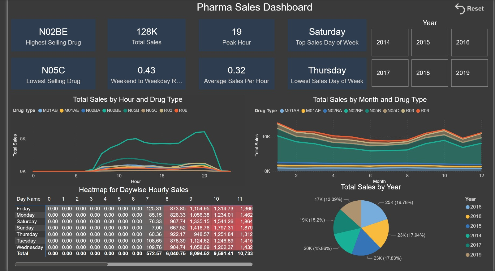
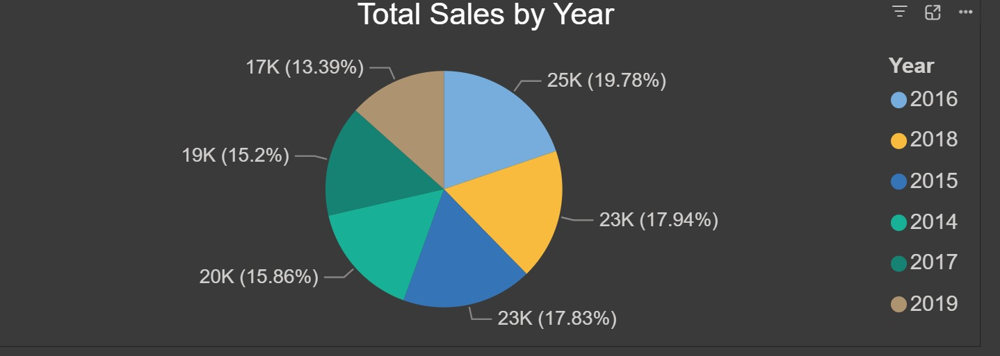
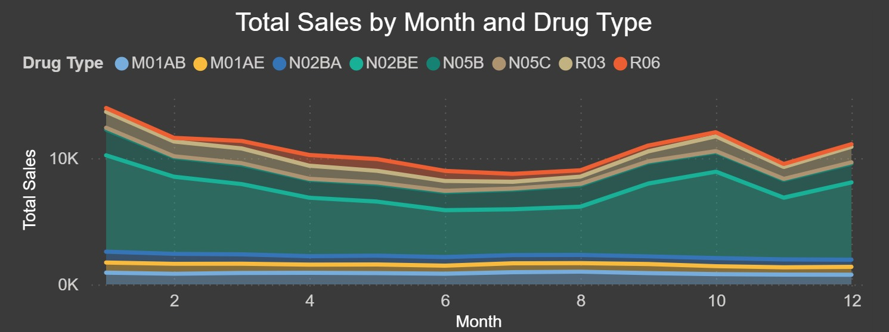
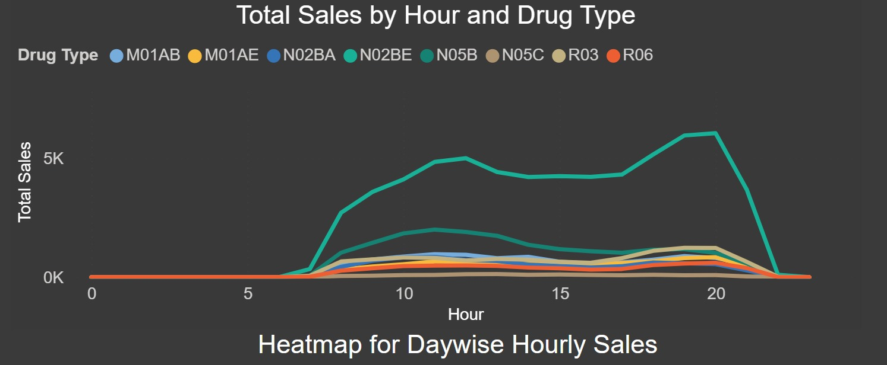
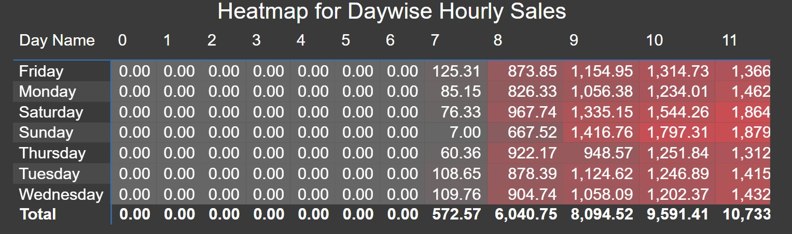

# 💊 Pharma Sales Dashboard - Power BI

This Power BI dashboard was built using pharma sales data to uncover key sales insights and performance metrics across different time dimensions and drug types. The goal of this project was to provide a user-friendly and interactive analytics experience for understanding trends in pharmaceutical sales.

Six years data (2014-2019) on sales of drugs classified in 8 ATC categories
---

## 📊 Dashboard Overview

 

The dashboard includes the following key performance indicators (KPIs) and visualizations:

### ✅ KPIs Calculated:
- **Highest Selling Drug**
- **Total Sales**
- **Peak Hour**
- **Top Sales Day of the Week**
- **Lowest Selling Drug**
- **Average Sales per Hour**
- **Weekend to Weekday Sales Ratio**
- **Lowest Sales Day of the Week**

---

## ⚙️ Functionalities

We have added interactions, year slicers, and a reset button built using the bookmark feature of Power BI.
---

## 📈 Visualizations

1. **Pie Chart** – Top Sales by Year  
   > 

2. **Stacked Area Chart** – Top Sales by Month and Drug Type  
   > 

3. **Line Chart** – Hourly Sales by Drug Type  
   > 

4. **Heatmap** – Day vs Hourly Sales Pattern  
   > 

---

## 🧮 KPI DAX Formulas

### 1. **Highest Selling Drug**
```dax
Highest Selling Drug = 
CALCULATE(
    SELECTEDVALUE(saleshourly[Drug Type]),
    TOPN(1,
	SUMMARIZE(
		saleshourly,
		saleshourly[Drug Type],
		"Total Drug Sales",sum(saleshourly[Value])
	),
	[Total Drug Sales], DESC
)
)
```

### 2. **Total Sales**
```dax
Total Sales = SUM(saleshourly[value])
```

### 3. **Peak Hour**
```dax
Peak Hour = 
CALCULATE(
    SELECTEDVALUE(saleshourly[Hour]),
    TOPN(1,
    SUMMARIZE(saleshourly, saleshourly[Hour],
    "Total Hourly Sales", SUM(saleshourly[Value])),
    [Total Hourly Sales], DESC)
)
```

### 4. **Top Sales Day of the Week**
```dax
Top Sales Day of Week = 
CALCULATE(
    SELECTEDVALUE(saleshourly[Weekday Name]),
    TOPN(1,
	SUMMARIZE(
		saleshourly,
		saleshourly[Weekday Name],
		"Total Drug Sales per weekday",sum(saleshourly[Value])
	),
	[Total Drug Sales per weekday], DESC
)
)
```

### 5. **Lowest Selling Drug**
```dax
Lowest Selling Drug = 
CALCULATE(
    SELECTEDVALUE(saleshourly[Drug Type]),
    TOPN(1,
	SUMMARIZE(
		saleshourly,
		saleshourly[Drug Type],
		"Total Drug Sales",sum(saleshourly[Value])
	),
	[Total Drug Sales], ASC
)
)
```

### 6. **Average Sales per Hour**
```dax
Average Sales Per Hour = 
DIVIDE (
    SUM(saleshourly[Value]),
    COUNTROWS(saleshourly),
    0
)
```

### 7. **Weekend/Weekday Ratio**
```dax
Weekend to Weekday Ratio = 
DIVIDE([Weekend Sales], [Weekday Sales],0)

Weekend Sales = 
CALCULATE(

    SUM(saleshourly[Value]),
    FILTER(
        'calendar',
        WEEKDAY('calendar'[Date],2)>=6 )
)

Weekday Sales = 
CALCULATE(

    SUM(saleshourly[Value]),
    FILTER(
        'calendar',
        WEEKDAY('calendar'[Date],2)<6 )
)
```

### 8. **Lowest Sales Day of the Week**
```dax
Lowest Sales Day of Week = 
CALCULATE(
    SELECTEDVALUE(saleshourly[Weekday Name]),
    TOPN(1,
	SUMMARIZE(
		saleshourly,
		saleshourly[Weekday Name],
		"Total Drug Sales per weekday",sum(saleshourly[Value])
	),
	[Total Drug Sales per weekday], ASC
)
)
```

---

## 🧩 Power Query (M Code)

> *(Add any Power Query logic here for transformations, date extraction, type conversions, and calculated columns like "IsWeekend" or "Hour")*

```
let
    Source = Csv.Document(File.Contents("D:\Abhishek\my workdesk\projects\Dashboards\Pharma sales\data\saleshourly.csv"),[Delimiter=",", Columns=13, Encoding=1252, QuoteStyle=QuoteStyle.None]),
    #"Promoted Headers" = Table.PromoteHeaders(Source, [PromoteAllScalars=true]),
    #"Added Custom" = Table.AddColumn(#"Promoted Headers", "datetime", each DateTime.FromText([datum], "en-US")),
    #"Removed Columns" = Table.RemoveColumns(#"Added Custom",{"datum"}),
    #"Inserted Date" = Table.AddColumn(#"Removed Columns", "Date", each DateTime.Date([datetime]), type date),
    #"Inserted Day" = Table.AddColumn(#"Inserted Date", "Day", each Date.Day([datetime]), Int64.Type),
    #"Inserted Week of Year" = Table.AddColumn(#"Inserted Day", "Week of Year", each Date.WeekOfYear([datetime]), Int64.Type),
    #"Inserted Quarter" = Table.AddColumn(#"Inserted Week of Year", "Quarter", each Date.QuarterOfYear([datetime]), Int64.Type),
    #"Unpivoted Columns" = Table.UnpivotOtherColumns(#"Inserted Quarter", {"Year", "Month", "Hour", "Weekday Name", "datetime", "Date", "Day", "Week of Year", "Quarter"}, "Attribute", "Value"),
    #"Renamed Columns" = Table.RenameColumns(#"Unpivoted Columns",{{"Attribute", "Drug Type"}})
in
    #"Renamed Columns"
```

---

## 🗂️ Folder Structure

```
pharma-sales-dashboard/
│
├── Pharma_Sales_Dashboard.pbix
├── README.md
├── /raw data
│   └── saleshourly.csv
├── /screenshots
│   ├── Pharma_Sales_Dashboard.jpeg
│   ├── heatmap_day_hour.jpeg
│   ├── line_chart_hourly_sales.jpeg
│   └── pie_chart_yearly_sales.jpeg
|   └── stacked_area_monthly_sales.jpeg
```

---

## 📬 Contact

For questions or feedback, please contact 

**[Abhishek Prasanna Walavalkar]** at **[abhishek.walavalkar13@gmail.com]**  [Linkedin](https://www.linkedin.com/in/abhishek-walavalkar-777130147/)

**[Gandhar Ravindra Pansare]** at **[gandharpansare@gmail.com]**  [Linkedin](https://www.linkedin.com/in/gandharpansare/)

---
